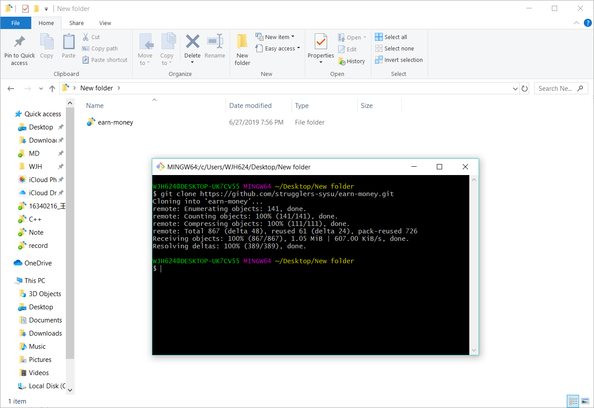
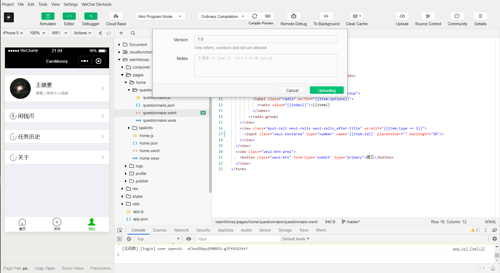

# 安装部署说明

### 部署准备

1.  win10环境

2.  安装git

3.  [按照官方教程，做好小程序开发准备](https://developers.weixin.qq.com/ebook?action=get_post_info&token=935589521&volumn=1&lang=zh_CN&book=miniprogram&docid=000e8842960070ab0086d162c5b80a)

### 部署过程

1.  在本地 `git bash`终端执行 `git clone https://github.com/strugglers-sysu/earn-money.git` 命令

    

2.  使用微信开发者工具打开`earn-money`项目

    

    

3.  点击界面界面左上==云控制平台==->==当前环境==->==创建新的云环境==->==填写任意环境名称==->==确认==

    

4.  云环境创建好之后，点击数据库，添加三个数据集合，==users==，==answers==，==tasks==

    

5.  之后，点击编译，然后上传，填写版本信息和备注

    

6.  登录[微信公众号平台](https://mp.weixin.qq.com/wxopen/wacodepage?action=getcodepage&token=2023750691&lang=zh_CN)，可以看到自己提交的开发版本

    

7.  点击提交审核，填写相关信息，通过审核后即可得到相关二维码

    

8.  用手机微信客户端扫描二维码即可使用

    