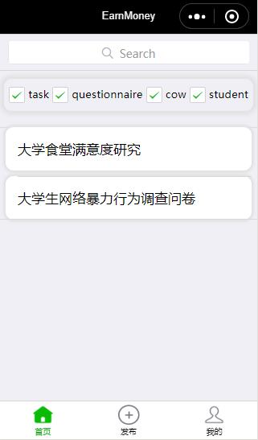
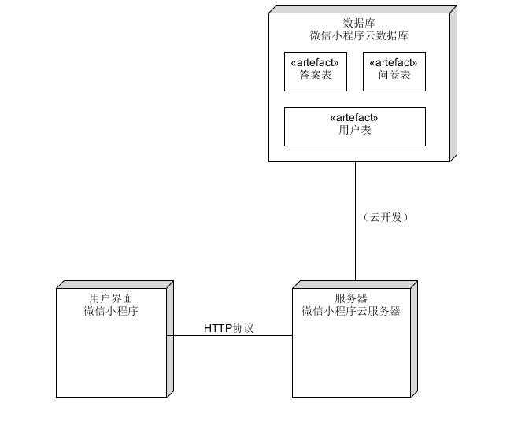

# 软件设计文档SD
## 1.技术选型
### 可选类型：web、app、小程序
小组讨论选择小程序去完成此次项目

### 对比其他两项，小程序的优势
#### 前端
小程序提供了自己的视图层描述语言 WXML 和 WXSS，以及基于 JavaScript 的逻辑层框架，并在视图层与逻辑层间提供了数据传输和事件系统，让开发者能够专注于数据与逻辑。其语言结构与web类似，有web基础容易上手。

#### 后端
开发者可以使用云开发开发微信小程序、小游戏，无需搭建服务器，即可使用云端能力。

云开发为开发者提供完整的原生云端支持和微信服务支持，弱化后端和运维概念，无需搭建服务器，使用平台提供的 API 进行核心业务开发，即可实现快速上线和迭代，同时这一能力，同开发者已经使用的云服务相互兼容，并不互斥。

## 2.界面设计
### 设计规则说明
微信小程序设计的基本原则是微信设计中心针对在微信类上线的小程序页面总结的设计指南及建议。以下设计原则都是基于对用户的尊重的基础上的，旨在微信生态类建立有号、高效、一致的用户体验的同时，最大程度顺应和支持各业务需求设计，实现用户与程序的共赢。
- 有好礼貌：为了避免用户在微信中使用小程序服务时，注意力被周围复杂环境干扰，小程序在设计时应该注意减少无关的设计元素对用户目标干扰，礼貌地向用户展示程序侧提供的服务，友好地引导用户进行操作。
- 重点突出：每个页面都应有明确的重点，以便于用户每进入一个新页面的时候都能快速地理解页面内容，在确定了重点的前提下，应尽量避免页面上出现其他干扰项影响用户的决策和操作。
- 反例示意：页面最好是简单明了的，我们遵循 less is more 的设计观念，给用户一个更加容易直接的产品使用体验。比如页面的主题是查询，却添加了诸多与查询不相关的业务入口，与用户的预期不符，易造成用户的迷失。

### 小程序界面
#### 登录注册

#### 微信端授权

#### 个人信息

#### 发布问卷

#### 问卷列表


## 3.数据库设计

### 用户及任务数据库设计

#### ER图


<a href="https://developers.weixin.qq.com/miniprogram/dev/wxcloud/basis/capabilities.html#数据库"> 云开发数据库文档</a><br>
云开发提供了一个 JSON 数据库，顾名思义，数据库中的每条记录都是一个 JSON 格式的对象。一个数据库可以有多个集合（相当于关系型数据中的表），集合可看做一个 JSON 数组，数组中的每个对象就是一条记录，记录的格式是 JSON 对象。<br>
云开发提供了一块存储空间，提供了上传文件到云端、带权限管理的云端下载能力，开发者可以在小程序端和云函数端通过 API 使用云存储功能。
在小程序端可以分别调用 wx.cloud.uploadFile 和wx.cloud.downloadFile 完成上传和下载云文件操作。

## 4.API设计
### 微信小程序使用云开发设计
<a href="https://developers.weixin.qq.com/miniprogram/dev/api/"> 微信小程序官方API文档</a><br>
<a href="https://developers.weixin.qq.com/miniprogram/dev/wxcloud/reference-client-api/"> 小程序端 API 文档</a><br>

云开发为开发者提供完整的原生云端支持和微信服务支持，弱化后端和运维概念，无需搭建服务器，使用平台提供的 API 进行核心业务开发，即可实现快速上线和迭代，同时这一能力，同开发者已经使用的云服务相互兼容，并不互斥。
### 在小程序端可调用 Collection.get  获取集合数据
```
db.collection('users').where({
        _openid: app.globalData.userInfo.openid
      }).get().then(res => {
        this.setData({
          'detail.type': res.data[0].type,
          'detail.sid': res.data[0].sid,
          'detail.name': res.data[0].name,
          'detail.age': res.data[0].age,
          'detail.gender': res.data[0].gender,
          'detail.grade': res.data[0].grade,
          'detail.pro': res.data[0].pro
        })
      })
```

### 可以用Collection.add在集合上新增记录
```
// 新用户，添加到数据库
      if (res.total == 0) {
        if (this.data.userType == 'student') {
          db.collection('users').add({
            // data 字段表示需新增的 JSON 数据
            data: {
              // _id: 'todo-identifiant-aleatoire', // 可选自定义 _id，在此处场景下用数据库自动分配的就可以了
              avatarUrl: e.detail.userInfo.avatarUrl,
              nickName: e.detail.userInfo.nickName,
              wallet: new Number(0),
              type: this.data.userType,
              sid: '',
              name: '',
              age: '',
              gender: '',
              grade: '',
              pro: ''
            }
```

### 可以通过 Document.update 更新一条记录
```
db.collection('users').doc(app.globalData.userInfo.id).update({
        // data 传入需要局部更新的数据
        data: {
          sid: e.detail.value.sid,
          name: e.detail.value.name,
          age: e.detail.value.age,
          gender: e.detail.value.gender,
          grade: e.detail.value.grade,
          pro: e.detail.value.pro
        }
      })
})
```

## 5.架构设计
### 微信小程序前端框架
<a href="https://developers.weixin.qq.com/miniprogram/dev/framework/MINA.html"> 微信小程序前端框架官方文档</a><br>
小程序开发框架的目标是通过尽可能简单、高效的方式让开发者可以在微信中开发具有原生 APP 体验的服务。

整个小程序框架系统分为两部分：逻辑层（App Service）和 视图层（View）。小程序提供了自己的视图层描述语言 WXML 和 WXSS，以及基于 JavaScript 的逻辑层框架，并在视图层与逻辑层间提供了数据传输和事件系统，让开发者能够专注于数据与逻辑。

#### 逻辑层 APP Service
小程序开发框架的逻辑层使用 JavaScript 引擎为小程序提供开发者 JavaScript 代码的运行环境以及微信小程序的特有功能。

逻辑层将数据进行处理后发送给视图层，同时接受视图层的事件反馈。

开发者写的所有代码最终将会打包成一份 JavaScript 文件，并在小程序启动的时候运行，直到小程序销毁。这一行为类似 ServiceWorker，所以逻辑层也称之为 App Service。

在 JavaScript 的基础上，我们增加了一些功能，以方便小程序的开发：
- 增加 App 和 Page 方法，进行程序注册和页面注册。
- 增加 getApp 和 getCurrentPages 方法，分别用来获取 App 实例和当前页面栈。
- 提供丰富的 API，如微信用户数据，扫一扫，支付等微信特有能力。
- 提供模块化能力，每个页面有独立的作用域。

#### 视图层 View
框架的视图层由 WXML 与 WXSS 编写，由组件来进行展示。

将逻辑层的数据反应成视图，同时将视图层的事件发送给逻辑层。

WXML(WeiXin Markup language) 用于描述页面的结构。

WXS(WeiXin Script) 是小程序的一套脚本语言，结合 WXML，可以构建出页面的结构。

WXSS(WeiXin Style Sheet) 用于描述页面的样式。

组件(Component)是视图的基本组成单元。

### 微信小程序云开发
<a href="https://developers.weixin.qq.com/miniprogram/dev/wxcloud/basis/getting-started.html"> 微信小程序云开发官方文档</a><br>
开发者可以使用云开发开发微信小程序、小游戏，无需搭建服务器，即可使用云端能力。

云开发为开发者提供完整的原生云端支持和微信服务支持，弱化后端和运维概念，无需搭建服务器，使用平台提供的 API 进行核心业务开发，即可实现快速上线和迭代，同时这一能力，同开发者已经使用的云服务相互兼容，并不互斥。

云开发提供了几大基础能力支持：
| 能力 | 作用 | 说明 |
| -- | -- | -- |
| 云函数 | 无需自建服务器 | 在云端运行的代码，微信私有协议天然鉴权，开发者只需编写自身业务逻辑代码 |
| 数据库 | 无需自建数据库 | 一个既可在小程序前端操作，也能在云函数中读写的 JSON 数据库 |
| 存储 | 无需自建存储和 CDN | 在小程序前端直接上传/下载云端文件，在云开发控制台可视化管理 |
| 云调用 | 原生微信服务集成 | 基于云函数免鉴权使用小程序开放接口的能力，包括服务端调用、获取开放数据等能力 |

### 逻辑视图


### 物理视图


## 6.用例设计
### 基本用例：
- 注册/登录：组织机构和学生都可以作为一个独立的用户，可以进行注册、登录系统。
- 发布任务：组织机构可以面向学生发布相应兼职作为任务，学生也同样可以发布自己想让其他同学做的任务。
- 做任务：学生通过系统可以接受组织机构提供的任务，并完成这些相应的任务。
- 充值/提现：组织机构和学生都可以在各自账务充值现金作为“闲钱币”，“闲钱币”作为学生完成任务的奖励，同样组织机构和学生可以将“闲钱币”提取成现金。
<br>

### 扩展用例：
- 微信登录：组织机构和学生可以选择使用微信账号作为登录方式，更加方便快捷。
<br>

### 包含用例：
- 完善个人/机构信息：在注册和登录完成后需要对本组织机构或本人的基本信息进行完善，以便于查找服务与系统推荐。
- 选择任务类型：组织机构或学生在发布任务时需要选择发布任务的类型。
- 填写任务信息：组织机构或学生在发布任务时需要填写所发布任务的具体信息。
- “闲钱币”支付：组织机构或学生在发布任务时需要支付一定数量的闲钱币作为悬赏。
- 浏览任务：学生在做任务前可以浏览当前已经发布的并且还未接受的任务。
- 接任务：学生可以决定接受相应的任务。
- 完成任务，领取“闲钱币”：学生在完成相应任务后，可以领取该任务作为悬赏的“闲钱币”。
<br>

### 主场景下的用户活动图


### 用例图


### 用户注册流程图


### 用户登录流程图


### 用户发布任务流程图


### 类图
