# 软件需求规格说明书
## 引言
### 编写目的
为明确软件需求、安排项目规划与进度、组织软件开发与测试，撰写本文档。
### 软件需求分析理论
软件需求分析（Software Reguirement Analysis）是研究用户需求得到的东西，完全理解用户对软件需求的完整功能，确认用户软件功能需求，建立可确认的、可验证的一个基本依据。
软件需求分析是一个项目的开端，也是项目实施最重要的关键点。据有关的机构分析结果表明，设计的软件产品存在不完整性、不正确性等问题80％以上是需求分析错误所导致的，而且由于需求分析错误造成根本性的功能问题尤为突出。
因此，一个项目的成功软件需求分析是关键的一步。
### 软件需求分析目标
软件需求分析应尽量提供软件实现功能需求的全部信息，使得软件设计人员和软件测试人员不再需要需求方的接触。
这就要求软件需求分析内容应正确、完整、一致和可验证。
此外，为保证软件设计质量，便于软件功能的休整和验证，软件需求表达无岔意性，具有可追踪性和可修改性。
## 需求概述
### 项目背景
做兼职一直以来在大学生中是很流行的补贴生活的方式，很多大学生们都想要能够在不影响学习的情况下去挣取一些零钱，但是又不想通过兼职这么费时间的工作。
只想着能够帮别人跑个腿之类的任务去赚取零钱。
因此，这个机会就可以把握住。 
在如今市场上有很多面向社会各界人士寻找工作和兼职的程序和平台，但还基本没有面向大学生的兼职平台，并且各种平台也是良莠不齐，无法确保安全性，这也让确实想要赚取零钱的大学生望而却步。
所以我们想通过开发微信小程序来触及到更多的未知与可能，将这一块市场进行开发。 
我们打算做的关于挣闲钱的小程序：在技术上，微信小程序越来越受人重视，开发成本也并不高；在功能上包括问卷，跑腿等任务。
力求将小程序做到符合多方利益，努力为社会提供一个有利无弊的可靠的大学生赚零钱平台。
在这种背景下，我们力所能及地进行了竞品调研，对线上找到的较优秀的产品做了体验和详尽分析，线下也对附近的商圈做了实地的考察，并亲测产品的可用性。
### 项目简介
- earn-money微信小程序的开发主要是为大学生们在上学期间，提供一个便捷的兼职的平台。
大学生兼职随着社会的发展，也变得越来越普遍，越来越多的大学生选择在大学期间兼职，不但可以挣去在生活上的费用，而且还能锻炼自己对社会的适应能力。
可以说很多大学生的兼职是他们这么大以来的第一份的工作，可以提前的为以后走进社会做准备。
- earn-money微信小程序拥有资源集中，用户群体集中，需求集中等的特点。主要是为大学生用户群体服务，面对校内校外的兼职服务。
并且大学生兼职是一个庞大的市场需求，每一所高校大学大部分的学生都做过兼职。
### 项目总体目标
- 本产品的用户群体是各类需要临时劳动力的中小型企业，以及所有在校大学生。
我们的目标是在商家与学生之间搭建一个在校大学生可以随时兼职赚零钱以及为商家提供可靠临时劳动力的平台，为各类企业提供便利以及降低雇佣成本，为在校学生提供良好的兼职环境和体验。
- 我们项目团队的另一个重要目标是，在本学期践行面向对象的系统分析与设计方法，体验完整的软件开发流程。
## 需求模型
### 用例图
 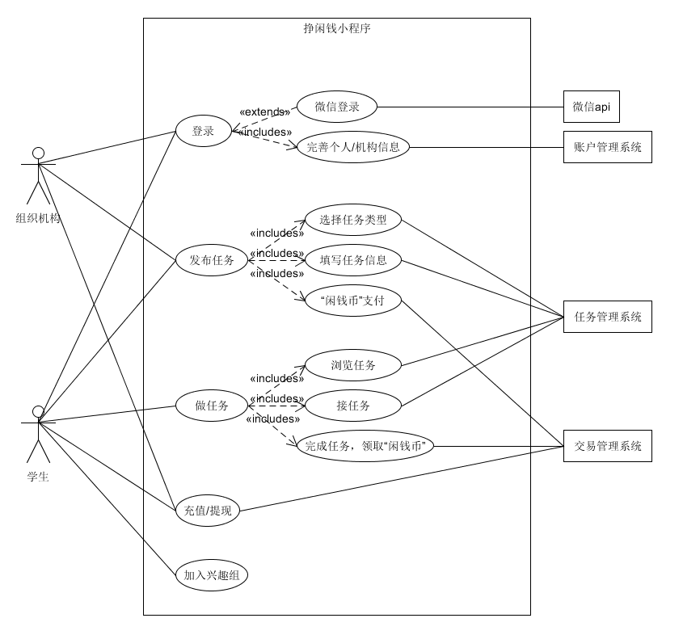
 **基本用例**：
- 注册/登录：组织机构和学生都可以作为一个独立的用户，可以进行注册、登录系统。
- 发布任务：组织机构可以面向学生发布相应兼职作为任务，学生也同样可以发布自己想让其他同学做的任务。
- 做任务：学生通过系统可以接受组织机构提供的任务，并完成这些相应的任务。
- 充值/提现：组织机构和学生都可以在各自账务充值现金作为“闲钱币”，“闲钱币”作为学生完成任务的奖励，同样组织机构和学生可以将“闲钱币”提取成现金。
- 加入兴趣组：学生可以加入兴趣组，互相交流评价，更容易找到适合的工作。

 **扩展用例**：
- 微信登录：组织机构和学生可以选择使用微信账号作为登录方式，更加方便快捷。

 **包含用例**：
- 完善个人/机构信息：在注册和登录完成后需要对本组织机构或本人的基本信息进行完善，以便于查找服务与系统推荐。
- 选择任务类型：组织机构或学生在发布任务时需要选择发布任务的类型。
- 填写任务信息：组织机构或学生在发布任务时需要填写所发布任务的具体信息。
- “闲钱币”支付：组织机构或学生在发布任务时需要支付一定数量的闲钱币作为悬赏。
- 浏览任务：学生在做任务前可以浏览当前已经发布的并且还未接受的任务。
- 接任务：学生可以决定接受相应的任务。
- 完成任务，领取“闲钱币”：学生在完成相应任务后，可以领取该任务作为悬赏的“闲钱币”。

### 活动图
**主场景下商家活动图**
 
 **主场景下学生活动图**
 .jpg)

### 领域模型图
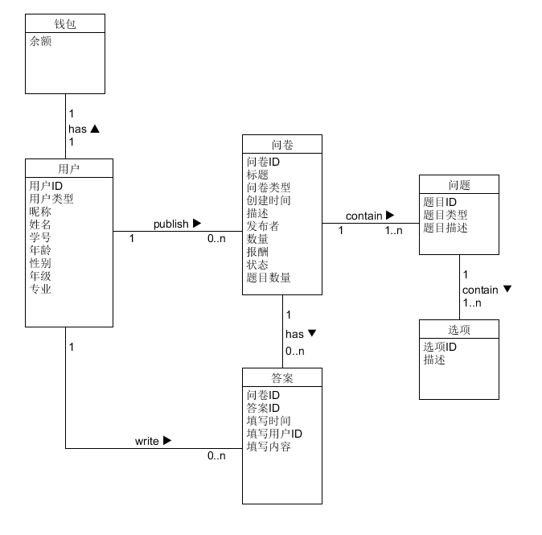

### 状态模型图
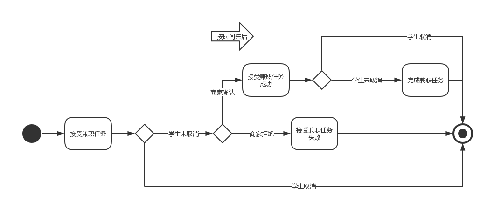

### 功能模型图
 **学生取消任务**
 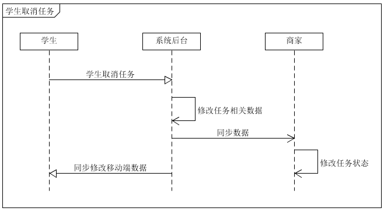
 **商家取消任务**
 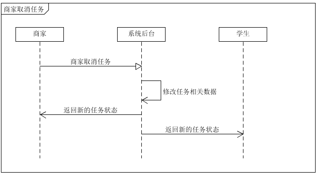
 **学生接受任务**
 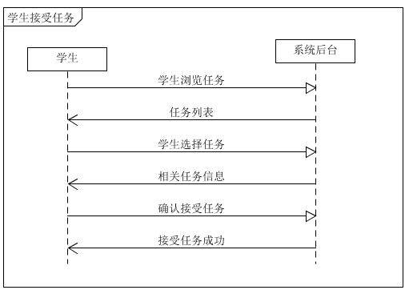
 **商家确认**
 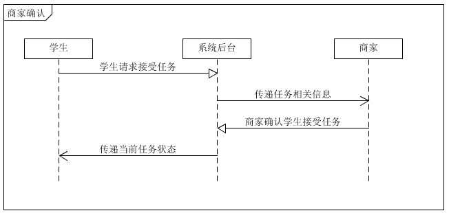
 **商家拒绝**
 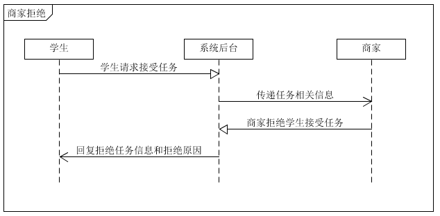
 **商家发布任务**
 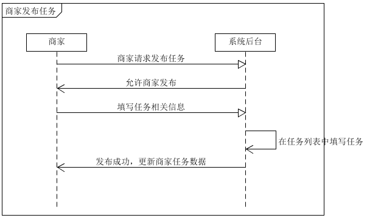
 **商家修改任务**
 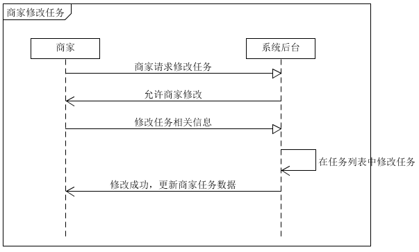
 **商家删除任务**
 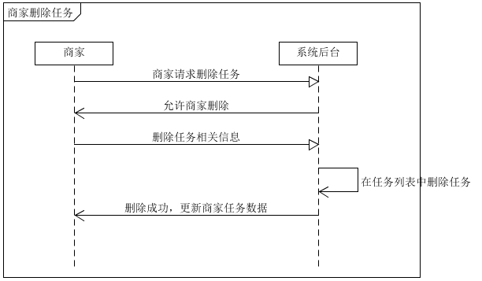
 **学生注册**
 
 **学生登录**
 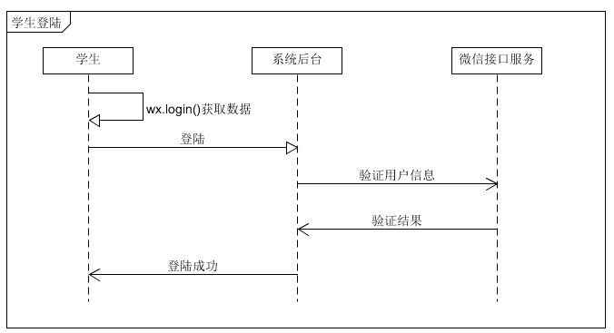
 **商家注册**
 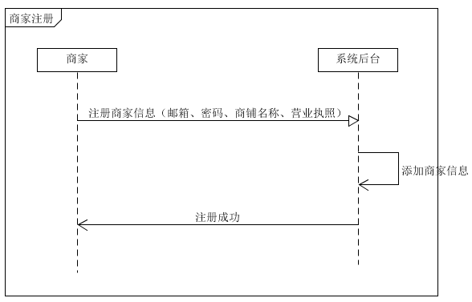
 **商家登录**
 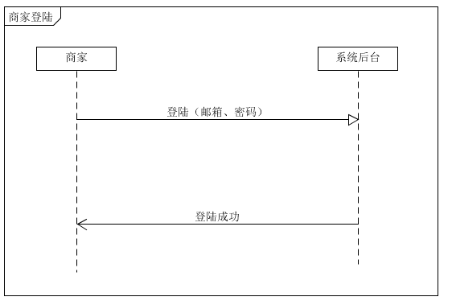
